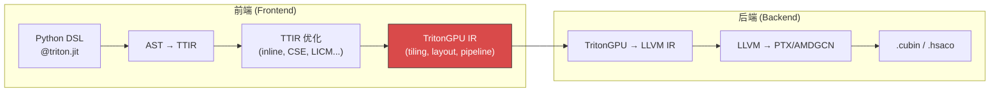
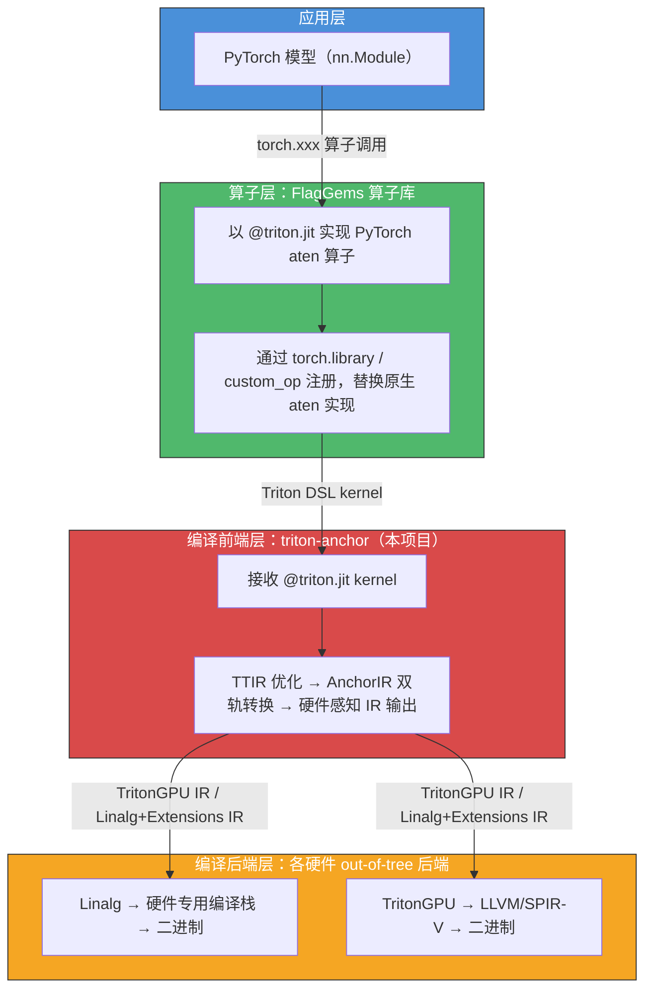
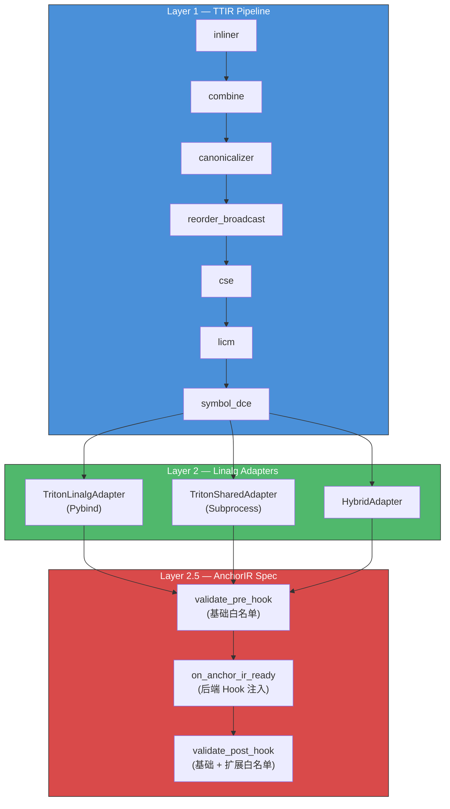

<p align="center">
  
</p>

<h1 align="center">triton-anchor</h1>

<!-- badges -->
<p align="center">
  <a href="LICENSE"></a>
  <a href="../../actions/workflows/ci.yml"></a>
  <a href="https://www.python.org/"></a>
  <a href="ROADMAP.md"></a>
</p>

> **项目定位**：面向多款芯片的共性编译前端，在统一的 Triton 编译前端中同时支持 **RISC-V Matrix 扩展指令集**（**AME）**、**RISC-V Tensor 扩展指令集**和 **SIMT 扩展指令集（GPGPU）** 的插件化架构。

> [!IMPORTANT]
> **AnchorIR**（锚点中间表示）是 triton-anchor 定义的 **双轨统一输出契约**——所有 TTIR 到硬件感知 IR 的转换，无论走 Linalg 路径还是 TritonGPU 路径，其输出都被纳入 AnchorIR 契约管理。

📋 **[路线图](ROADMAP.md)** · 📖 **[构建指南](docs/build.md)** · 🔌 **[后端接入指南](docs/custom_backend.md)** · 🔒 **[安全策略](SECURITY.md)** · 💬 **[报告问题](../../issues/new/choose)**

---

## 目录

- [1. "前端"的边界定义](#1-前端的边界定义)
- [2. 与上游项目的分工边界](#2-与上游项目的分工边界)
- [3. 架构设计](#3-架构设计)
- [4. 快速开始](#4-快速开始)
- [5. 目录结构](#5-目录结构)
- [6. 编译流程](#6-编译流程)
- [7. API 参考](#7-api-参考)
- [8. 硬件后端集成](#8-硬件后端集成)
- [9. 测试](#9-测试)
- [10. 参与贡献](#10-参与贡献)
- [11. FAQ](#11-faq)
- [12. License](#12-license)

---

## 1. "前端"的边界定义

### 1.1 以 TritonGPU IR 为参照

在 OpenAI 标准 Triton 中，**TritonGPU IR 是前后端的分界线**：



*   **向上（前端职责）**：tiling 决策、数据布局分配、内存层次映射、流水线 stage 划分
    
*   **向下（后端职责）**：硬件指令选择、寄存器分配、二进制生成
    

### 1.2 非 GPU 后端的等价层次

对于 Linalg 路径后端，**Linalg + Extensions IR** 扮演与 TritonGPU IR 完全等价的角色：

| 维度 | TritonGPU IR (GPU) | Linalg + Extensions (非 GPU) |
| --- | --- | --- |
| **Tiling** | block/warp/thread 分解 | `smt.parallel`, LinalgExt tiling |
| **布局** | `#blocked`, `#shared`, `#mma` | `memref` 布局, `xsmt.ViewOp` |
| **内存层次** | shared memory allocation | `smt.alloc(storage="l2")` |
| **计算原语** | `tt.dot` → MMA | `smt.dot` (MMT4D), `linalg.matmul` |
| **同步** | `__syncthreads()` | `smt.mbarrier` / `xsmt_async.*` |

### 1.3 统一定义

> \[!IMPORTANT\] **编译前端 = 全栈编译工具链中，负责将 Triton DSL 转换为"硬件感知中间表示"的编译器部分。**

*   **输入**：`@triton.jit` Python 函数
    
*   **输出**：硬件感知但非硬件特定的 IR（TritonGPU IR 或 Linalg+Extensions IR）
    
*   **职责**：DSL 解析、TTIR 生成/优化、指针分析、Tiling 决策、计算原语匹配
    
*   **不包含**：目标硬件指令选择（待确认）、寄存器分配、二进制生成
    

## 2 与上游项目的分工边界

### 2.1 整体定位

triton-anchor 是面向多款芯片的 **共性编译前端**，其核心目标是 **对接 [FlagGems](https://github.com/FlagOpen/FlagGems) 算子库**，从而在非 NVIDIA GPU 硬件上 **代替 PyTorch 原生 Tensor 计算算子库（`aten` 算子）**。

整体协作关系如下：



### 2.2 明确分工

| 职责 | 归属 | 说明 |
|------|------|------|
| **PyTorch 算子注册与分发** | FlagGems | 通过 `torch.library` 将 Triton kernel 注册为 `aten` 算子的替代实现 |
| **Triton Kernel 编写** | FlagGems | 以 `@triton.jit` 编写高性能算子（matmul, softmax, layernorm 等） |
| **Triton DSL → 硬件感知 IR** | **triton-anchor** | TTIR 生成/优化 → AnchorIR 双轨验证 → 输出到硬件后端 |
| **硬件 IR → 二进制** | 各硬件后端 | 指令选择、寄存器分配、二进制生成（out-of-tree） |
| **运行时调度** | PyTorch + 硬件后端 | Kernel launch、内存管理、Stream 同步 |

### 2.3 triton-anchor 不负责的事项

- ❌ **不编写 Triton kernel**——算子实现由 FlagGems 提供
- ❌ **不注册 PyTorch 算子**——算子分发由 FlagGems 的 `torch.library` 机制完成
- ❌ **不生成硬件二进制**——后端代码生成由各 out-of-tree 后端独立维护
- ❌ **不实现运行时驱动**——`DriverBase` 由各硬件后端包提供

### 2.4 典型工作流示例

```python
import torch
import flag_gems  # FlagGems 算子库

# FlagGems 自动将 aten 算子替换为 Triton 实现
flag_gems.enable()

# 用户代码无需修改，正常调用 PyTorch API
y = torch.softmax(x, dim=-1)  # 实际执行 FlagGems 的 Triton softmax kernel

# 编译路径：
# FlagGems softmax kernel (@triton.jit)
#   → triton-anchor (TTIR → AnchorIR → Linalg/TritonGPU)
#     → 硬件后端 (Linalg → binary)
```

---

## 3 架构设计

triton-anchor 将编译流程前端化，分离了与具体硬件无关的公共优化与转换逻辑，整体架构分为三个核心层级：

```
Layer 1    — TTIR Pipeline        (7 mandatory passes)
Layer 2    — Linalg Adapters      (ILinalgOptAdapter / ILinalgPybindAdapter)
Layer 2.5  — AnchorIR Spec        (dual-track whitelist + two-phase validation)
```

### 3.1 核心设计特性

- **双轨 AnchorIR**：为不同的计算硬件提供两条标准路径——Linalg Track（面向 Tensor Processor 与 AME Matrix）与 TritonGPU Track（面向 gpGPU），每条路径拥有独立的 Op 白名单。
- **两阶段验证**：AnchorIR 的合法性会经历 `validate_pre_hook()` → Hook 注入 → `validate_post_hook()` 两阶段检查，确保底层硬件后端注入的扩展 Op 也严格受契约约束。
- **ABI 隔离**：提供 `ILinalgOptAdapter`（基于子进程调用 `opt` 的模式）与 `ILinalgPybindAdapter`（基于 Pybind 绑定的模式），在类型层面隔离 C++ ABI，避免多后端带来的符号冲突。
- **Paradigm / Track 解耦**：`ComputeParadigm`（计算范式）与 `AnchorIRTrack`（IR 轨道）独立声明，硬件后端可根据自身特性自由组合。

### 3.2 架构总览



## 4 快速开始

### 4.1 环境要求

| 依赖 | 最低版本 | 说明 |
|------|---------|------|
| Python | 3.9+ | 推荐 3.10 |
| CMake | 3.20+ | C++ 扩展构建 |
| Ninja | 1.10+ | 构建系统 |
| LLVM/MLIR | 见 `triton/cmake/llvm-hash.txt` | 完整构建必需 |
| pybind11 | 2.10+ | Python ↔ C++ 绑定 |

### 4.2 快速安装

```bash
# 克隆仓库（含 Triton 子模块）
git clone --recurse-submodules https://github.com/RACE-org/triton-anchor.git
cd triton-anchor

# 配置 LLVM 路径
export LLVM_SYSPATH=/path/to/llvm-release

# 使用 uv 安装（推荐，极速）
pip install uv
uv pip install --no-build-isolation -e .

# 验证安装
python -c "import triton_anchor; print(f'triton-anchor {triton_anchor.__version__} loaded')"
```

### 4.3 仅安装纯 Python 模块（无需 LLVM）

如果你只需要使用 `HWCapability`、`AnchorIRValidator` 等纯 Python API（例如开发后端 Plugin 时），可以跳过 C++ 构建：

```bash
# 将 python/ 目录加入 PYTHONPATH 即可
export PYTHONPATH=/path/to/triton-anchor/python:$PYTHONPATH

python -c "from triton_anchor import HWCapability, ComputeParadigm; print('OK')"
```

### 4.4 开发模式

```bash
# 安装包含测试工具的完整开发依赖
uv pip install -e ".[dev]"

# 运行单元测试
pytest python/triton_anchor/tests/ -v

# 代码风格检查
pip install ruff
ruff check python/ tests/
```

> 💡 **完整构建指南**（Docker 环境配置、LLVM 源码编译、Wheel 打包等）请参阅 [docs/build.md](docs/build.md)。

## 5 目录结构

```
triton-anchor/
├── triton/                      # 上游 Triton 核心（C++ 基础设施与原版 Python 前端，submodule）
├── csrc/                        # triton-anchor 扩展的 C++ Passes (例如 triton-linalg)
├── docs/                        # 文档
│   ├── build.md                 #   构建与环境配置指南
│   └── custom_backend.md        #   自定义硬件后端接入指南
├── tests/                       # 框架级和端到端测试
│   ├── test_discovery.py        #   entry_points 后端发现测试
│   └── test_e2e.py              #   端到端编译链路测试
├── .github/                     # GitHub 配置
│   ├── workflows/ci.yml         #   CI 流水线（lint + 单元测试）
│   └── ISSUE_TEMPLATE/          #   Issue 模板（Feature Request / Bug Report）
├── ROADMAP.md                   # 项目路线图
├── CMakeLists.txt               # CMake 顶层构建
├── pyproject.toml               # Python 包元数据
├── setup.py                     # 统一构建脚本（CMake + setuptools）
└── python/
    └── triton_anchor/           # triton-anchor 纯前端逻辑层
        ├── __init__.py          # 公共 API: HWCapability, ComputeParadigm, AnchorIRTrack
        ├── hw_capability.py     # HWCapability 硬件能力声明
        ├── anchor_ir.py         # AnchorIR 双轨规范白名单 + 两阶段验证器
        ├── pipeline.py          # 统一 TTIR Pipeline (7 pass)
        │
        ├── adapters/            # Layer 2: Linalg Adapters
        │   ├── base.py                      # ILinalgOptAdapter / ILinalgPybindAdapter 基类
        │   ├── registry.py                  # Adapter 自动注册表
        │   ├── triton_linalg_adapter.py      # triton-linalg pass 管线 (Pybind)
        │   ├── triton_shared_adapter.py      # triton-shared pass 管线 (Subprocess)
        │   └── hybrid_adapter.py             # 混合模式 Adapter
        │
        ├── language/            # DSL Extensions
        │   └── ext/             #   扩展指令命名空间
        │
        └── tests/               # 纯 Python 单元测试
            ├── test_anchor_ir.py     # AnchorIR 验证器测试
            └── test_hw_capability.py  # HWCapability 测试
```

## 6 编译流程

triton-anchor 负责统一管线的前半部分（TTIR → Linalg / TritonGPU），后半部分（Linalg → 硬件二进制）由各硬件后端独立完成。

```
AST → TTIR
  │
  ├── Layer 1: build_ttir_pipeline (7 pass)
  │     ├── inliner → combine → canonicalizer → reorder_broadcast → cse → licm → symbol_dce
  │     └── [GPU] _require_pass(add_rewrite_tensor_pointer)
  │
  ├── Layer 2: Adapter.convert()
  │     ├── Linalg Track: TritonLinalgAdapter (pybind) / TritonSharedAdapter (subprocess)
  │     └── TritonGPU Track: 直通后端
  │
  ├── Layer 2.5: AnchorIR 验证
  │     ├── validate_pre_hook()  ← 基础白名单
  │     └── validate_post_hook() ← 基础 + 扩展白名单
  │
  └── 硬件后端 (out-of-tree)
        ├── Tensor Processor:   Linalg → 专用编译栈 → .so
        ├── AME Matrix:         Linalg → LLVM → .so
        └── gpGPU:              TritonGPU → SPIR-V → binary
```

## 7 API 参考

### 7.1 核心类型

| 类 / 函数 | 模块 | 说明 |
|-----------|------|------|
| `HWCapability` | `triton_anchor.hw_capability` | 硬件能力声明（计算范式、架构族、指针模型等） |
| `ComputeParadigm` | `triton_anchor.hw_capability` | 枚举：`AME_MATRIX` / `TENSOR_PROCESSOR` / `GPGPU` |
| `MatrixCapability` | `triton_anchor.hw_capability` | AME 矩阵扩展能力描述（tile 形状、寄存器数量等） |
| `TensorCapability` | `triton_anchor.hw_capability` | Tensor Processor 能力描述（核心数、SRAM 大小等） |
| `GPGPUCapability` | `triton_anchor.hw_capability` | GPGPU 能力描述（warp 大小、共享内存等） |
| `AnchorIRTrack` | `triton_anchor.anchor_ir` | 枚举：`LINALG` / `TRITON_GPU` |
| `AnchorIRValidator` | `triton_anchor.anchor_ir` | 两阶段 AnchorIR 合法性验证器 |
| `build_ttir_pipeline()` | `triton_anchor.pipeline` | 构建 7-pass TTIR 优化管线 |
| `make_ttir()` | `triton_anchor.pipeline` | 便捷函数：构建管线 + 运行 |

### 7.2 使用示例

**声明硬件能力**

```python
from triton_anchor import HWCapability, ComputeParadigm
from triton_anchor.anchor_ir import AnchorIRTrack
from triton_anchor.hw_capability import TensorCapability

hw = HWCapability(
    name="my-npu-v1",
    arch_family="tpu",
    compute_paradigm=ComputeParadigm.TENSOR_PROCESSOR,
    anchor_ir_track=AnchorIRTrack.LINALG,
    ptr_model="axis_info",
    tensor_cap=TensorCapability(num_cores=8, local_mem_size=16 * 1024 * 1024),
)
```

**验证 AnchorIR 合规性**

```python
from triton_anchor.anchor_ir import AnchorIRValidator, AnchorIRTrack

validator = AnchorIRValidator(track=AnchorIRTrack.LINALG)

# Phase 1: Adapter 输出后、Hook 注入前
violations = validator.validate_pre_hook(ir_text)
assert len(violations) == 0, f"Pre-hook violations: {violations}"

# Phase 2: Hook 注入后，含扩展白名单
violations = validator.validate_post_hook(ir_text, ext_allowed={"xsmt", "xsmt_async"})
assert len(violations) == 0, f"Post-hook violations: {violations}"
```

**构建 TTIR 管线**

```python
from triton_anchor.pipeline import build_ttir_pipeline, make_ttir

# 方式 1：手动构建并运行
pm = ir.pass_manager(mod.context)
build_ttir_pipeline(pm, hw=my_hw_capability)
pm.run(mod)

# 方式 2：便捷一步调用
mod = make_ttir(mod, metadata={}, hw=my_hw_capability)
```

## 8 硬件后端集成

硬件后端（如特定的 TPU 或 NPU）作为**独立的 out-of-tree 包**实现，不在 triton-anchor 内部维护。详细的接入指南请参阅 [docs/custom_backend.md](docs/custom_backend.md)。

### 8.1 自动发现与注册
各硬件后端通过 `pyproject.toml` 中的 `entry_points` 机制自动注册，在 `import triton` 时被 Triton 发现：

```toml
# 硬件后端包的 pyproject.toml
[project.entry-points."triton.backends"]
my_device = "triton_my_device"
```

后端包的 `__init__.py` 需要在模块级导出以下两个属性供 pull 模式使用：

```python
# triton_my_device/__init__.py
from .compiler import MyDeviceBackend
from .runtime import MyDeviceDriver

compiler_cls = MyDeviceBackend   # 继承 triton.backends.compiler.BaseBackend
driver_cls = MyDeviceDriver      # 继承 triton.backends.driver.DriverBase
```

### 8.2 计算范式参考

| 计算范式 | 包名示例 | AnchorIR Track | 说明 |
|------|------|------|------|
| **Tensor Processor** | `triton-sophgo-backend` | Linalg | 面向具备独立 Tensor Core/NPU 的专用加速器 |
| **AME Matrix** | `ongoing` | Linalg | 面向带矩阵扩展指令集的 RISC-V 架构 |
| **gpGPU** | `ongoing` | TritonGPU | 面向 SIMT 架构 GPU |


## 9 测试

### 9.1 纯 Python 单元测试（无需 LLVM）

```bash
# 安装测试依赖
pip install pytest pytest-cov

# 运行单元测试
pytest python/triton_anchor/tests/ -v --tb=short

# 带覆盖率
pytest python/triton_anchor/tests/ -v --cov=python/triton_anchor --cov-report=term-missing
```

### 9.2 端到端测试（需完整构建环境）

```bash
# 需要先完成完整安装（包含 C++ 扩展）
pytest tests/ -v
```

### 9.3 CI

项目已配置 [GitHub Actions CI](.github/workflows/ci.yml)，每次 push / PR 自动运行：

| Job | 内容 | 矩阵 |
|-----|------|------|
| **lint** | `ruff check` + `ruff format --check` | Python 3.10 |
| **unit-test** | 纯 Python 单元测试 + 覆盖率 | Python 3.9 / 3.10 / 3.11 / 3.12 |

## 10 参与贡献

我们欢迎各种形式的贡献！

### 10.1 贡献流程

```bash
# 1. Fork 并克隆
git clone --recurse-submodules https://github.com/<你的用户名>/triton-anchor.git
cd triton-anchor

# 2. 创建功能分支
git checkout -b feature/your-feature-name

# 3. 开发并添加测试
# ...

# 4. 确保测试通过
pytest python/triton_anchor/tests/ -v
ruff check python/ tests/
ruff format python/ tests/

# 5. 提交 PR
git push origin feature/your-feature-name
```

### 10.2 贡献类型

| 类型 | 说明 |
|------|------|
| 🐛 Bug 修复 | 使用 [Bug Report 模板](.github/ISSUE_TEMPLATE/bug_report.yml) 提交 Issue |
| ✨ 新功能 | 使用 [Feature Request 模板](.github/ISSUE_TEMPLATE/feature_request.yml) 提交 Issue |
| 📖 文档改进 | 修复文档错误、补充示例 |
| 🧪 测试补充 | 为现有模块增加单元测试 |
| 🔌 新后端 | 创建独立的 out-of-tree 后端包，参考 [后端接入指南](docs/custom_backend.md) |

### 10.3 代码规范

- **代码风格**：使用 [Ruff](https://github.com/astral-sh/ruff) 进行 lint 和格式化
- **类型标注**：新增 Python 代码应包含类型注解
- **文档字符串**：公共 API 使用 Google 风格 docstring
- **测试要求**：新功能必须附带单元测试

## 11 FAQ

<details>
<summary><b>Q: triton-anchor 与上游 Triton 的关系是什么？</b></summary>

triton-anchor 在上游 Triton 的基础上扩展了编译前端，使其支持非 GPU 硬件。`triton/` 目录包含上游 Triton 核心代码（作为 submodule），triton-anchor 不修改上游代码，而是通过 Adapter 和 Plugin 机制进行扩展。
</details>

<details>
<summary><b>Q: 我需要自己写 Triton kernel 吗？</b></summary>

不需要。triton-anchor 负责编译已有的 Triton kernel（例如 FlagGems 算子库提供的 kernel），不负责算子编写。你可以直接使用 FlagGems 提供的高性能算子。
</details>

<details>
<summary><b>Q: 我的硬件后端使用 Linalg Track 还是 TritonGPU Track？</b></summary>

- 如果你的硬件是 **SIMT 架构 GPU**（线程 / warp / shared memory），使用 **TritonGPU Track**
- 如果你的硬件是 **Tensor Processor** 或 **RISC-V 矩阵扩展**，使用 **Linalg Track**
- `ComputeParadigm` 和 `AnchorIRTrack` 是解耦的，你可以根据硬件特性自由组合
</details>

<details>
<summary><b>Q: 不安装 LLVM 也能运行测试吗？</b></summary>

可以。`python/triton_anchor/tests/` 下的单元测试为纯 Python 测试，不依赖 C++ 构建产物和 LLVM。只有 `tests/test_e2e.py` 端到端测试需要完整的构建环境。
</details>

<details>
<summary><b>Q: 如何为我的芯片创建后端？</b></summary>

请参阅 [自定义硬件后端指南](docs/custom_backend.md)，其中包含完整的 `BaseBackend` 和 `DriverBase` 实现示例。核心步骤：
1. 创建独立的 Python 包
2. 注册 `entry_points` 到 `triton.backends`
3. 实现 `compiler_cls` (BaseBackend) 和 `driver_cls` (DriverBase)
4. 声明 `HWCapability`
</details>

---

## 12 License

本项目基于 [Apache License 2.0](http://www.apache.org/licenses/LICENSE-2.0) 开源发布。详见 [LICENSE](LICENSE) 文件。

```
Copyright 2026 RISC-V AI算力生态（RACE）委员会 & 北京开源芯片研究院 （BOSC）
```

### 12.1 致谢与引用项目

triton-anchor 的开发离不开以下优秀的开源项目，本项目引用并受益于它们的工作成果：

| 项目 | 许可证 | 链接 |
|------|--------|------|
| **Triton** | MIT License | [https://github.com/triton-lang/triton](https://github.com/triton-lang/triton) |
| **triton-linalg** | Apache 2.0 | [https://github.com/Cambricon/triton-linalg](https://github.com/Cambricon/triton-linalg) |
| **triton-shared** | MIT License | [https://github.com/microsoft/triton-shared](https://github.com/microsoft/triton-shared) |
| **FlagGems** | Apache 2.0 | [https://github.com/FlagOpen/FlagGems](https://github.com/FlagOpen/FlagGems) |

### 12.2 发布者

- **RISC-V AI算力生态（RACE）委员会**
- **北京开源芯片研究院（BOSC）**

### 12.3 专利风险免责声明

> [!WARNING]
> **Patent Disclaimer / 专利免责声明**
>
> 本项目按「现状」（AS IS）提供，**不包含任何明示或暗示的专利许可授权**。
>
> triton-anchor 的设计涉及编译器前端优化、中间表示转换及多后端适配等技术领域，这些领域可能存在第三方持有的专利。项目维护者和贡献者 **不对因使用本项目而可能产生的任何专利侵权承担责任**。
>
> 使用者应自行评估以下风险：
> - 本项目所依赖的上游项目（Triton、triton-linalg、triton-shared 等）可能涉及的专利
> - 本项目所集成的第三方算子库（如 FlagGems）可能涉及的专利
> - 将本项目编译产物部署到特定硬件平台时，目标硬件指令集可能涉及的专利
> - 本项目中使用的编译优化技术（tiling、layout 转换、流水线调度等）可能涉及的专利
>
> **建议在将本项目用于商业产品之前，咨询专业的知识产权法律顾问。**
>
> 本声明不构成法律建议。Apache License 2.0 第 3 条所授予的专利许可仅限于贡献者自身持有的专利权利要求，不扩展至第三方专利。

<!-- ci trigger test -->
